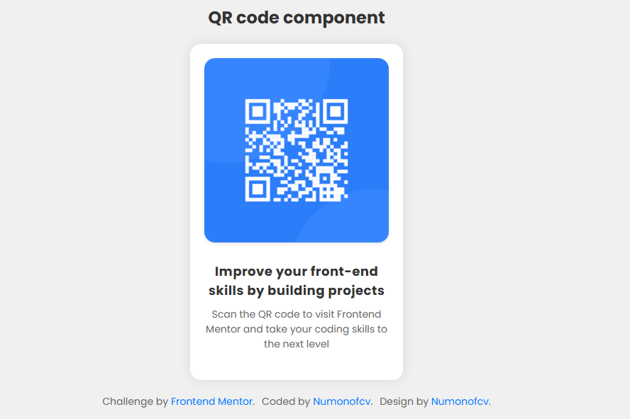
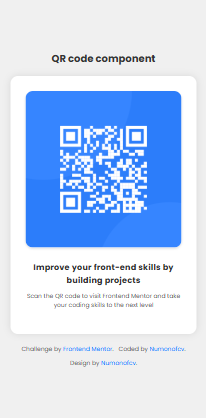

# Frontend Mentor - QR Code Component Solution

This is my solution to the [QR code component challenge on Frontend Mentor](https://www.frontendmentor.io/challenges/qr-code-component-iux_sIO_H).
Frontend Mentor challenges help me practice building real-world projects and improve my HTML and CSS skills.

---

## 📑 Table of contents

* [Overview](#overview)

  * [Screenshot](#screenshot)
  * [Links](#links)
  * [Built with](#built-with)
  * [What I learned](#what-i-learned)
  * [Continued development](#continued-development)
* [Author](#author)

---

## 📌 Overview

### 📷 Screenshot




---

### 🔗 Links

* Solution URL: [View solution on Frontend Mentor](https://www.frontendmentor.io/solutions/your-solution-link)
* Live Site URL: [Live site here](https://your-live-site-url.com)

---

## ⚙️ My process

### ✅ Built with

* Semantic **HTML5**
* **CSS Flexbox**
* **Mobile-first** workflow
* `aspect-ratio` for responsive images

---

### ✨ What I learned

In this project, I practiced using:

* `aspect-ratio` for maintaining image proportions
* Flexbox for centering content
* Semantic HTML structure
* Clean hover effects

Example:

```css
.card__image {
  aspect-ratio: 1 / 1;
  object-fit: cover;
}
```

---

### 🚀 Continued development

I want to continue improving my responsive design skills and learn more about **CSS animations** and **accessibility best practices**.

---

## 👤 Author

* Frontend Mentor: [@Numonofcv](https://www.frontendmentor.io/profile/Numonofcv)

---

## ✅ O‘zbekcha izoh

**Frontend Mentor - QR Kod Komponenti Loyihasi**

Bu loyiha [Frontend Mentor QR code challenge](https://www.frontendmentor.io/challenges/qr-code-component-iux_sIO_H) uchun tayyorlangan yechimdir.
Frontend Mentor orqali men **real loyihalar** yaratishni va **HTML / CSS** ko‘nikmalarimni mustahkamlayapman.

---

**Asosiy texnologiyalar:**

* Semantik **HTML5**
* **CSS Flexbox**
* Mobilga mos (responsive) tartib
* `aspect-ratio` yordamida rasm nisbatini ushlab turish

---

**Nima o‘rgandim:**

* Flexbox bilan sahifa markazlash
* `aspect-ratio` bilan rasmni to‘g‘ri chiqarish
* Oddiy va toza hover effektlar

---

**Davomiy rivojlanish:**

* Responsive dizaynni yanada mukammal o‘rganaman
* Animatsiya va kirish qulayligi (**accessibility**) bo‘yicha bilimlarni oshiraman

---

**Muallif:**

* Frontend Mentor: [@Numonofcv](https://www.frontendmentor.io/profile/Numonofcv)

---

# ✅ Rahmat!
